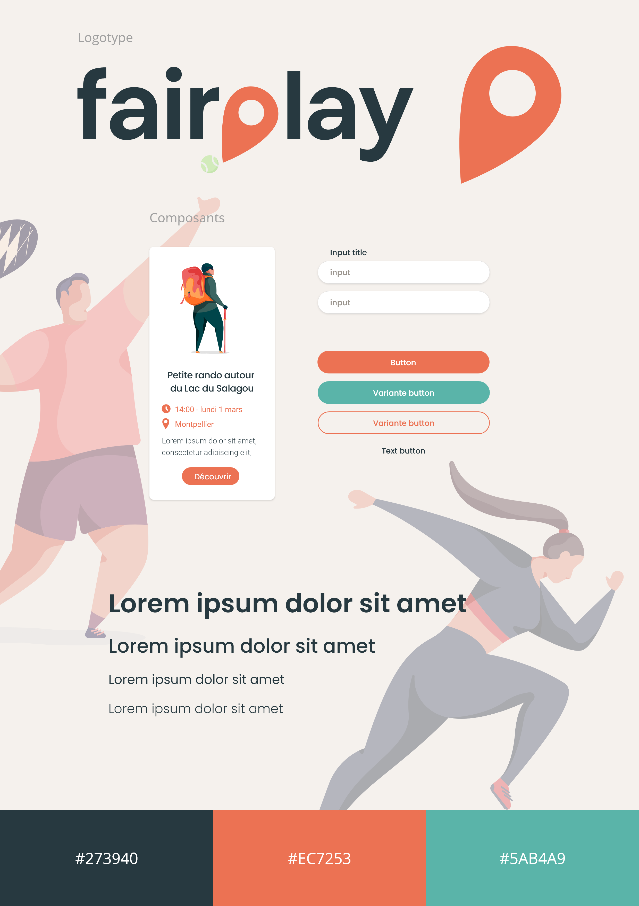

# Fairplay

## Naissance du projet

Ce projet est né en pleine crise sanitaire, d'une envie de s'évader et de
pratiquer une activité physique malgré la situation actuelle qui démotive
et déprime bon nombre de personnes. Nous ressentions l'envie de créer
une application permettant une émulation collective autour d'activités
sportives et offrant un coté social qui ne peut faire que du bien aux gens
en ce moment.

## Objectif

Fairplay propose de mettre en lien des sportifs de tous niveaux à la
recherche d’une motivation et de convivialité autour d’activités sportives.
Elle doit aussi permettre de faire des rencontres et de découvrir de
nouveaux sports à travers une interface permettant de rechercher,
proposer et rejoindre des activités sportives par rapport à une localisation
géographique. En outre l'application permettra de simplifier la mise en
relation des sportifs (peu importe le niveau) et l’organisation d’activités
sportives collectives.

## Stack technique

### Front

React, Redux, SCSS, Axios, Mapbox-gl, PositionStack

### Back

Node.js, Express, Sequelize, PostgreSQL, Express-JWT, Cookie-parser, Day.js, Cors, Bcrypt, O2switch

## Charte graphique

## Rôles utilisateurs de l’application

### Utilisateurs non connectés

Ils ont accès à la page d'accueil, à la page de recherche d'activités, à la
page équipe et la page d'inscription et de connexion.

### Utilisateurs connectés

Ils ont accès en plus des pages d'utilisateurs non connectés, à la page
détails d'une application et par conséquent ils peuvent rejoindre et
quitter une activité. Ils peuvent aussi créer une activité et échanger avec
les autres utilisateurs à l'aide du système de commentaires.

## Fonctionnalités de l'application

- afficher les activités

- consulter les détails d’une activité

- système de commentaires entre utilisateurs pour chaque activité
- visualiser le lieu de l’activité sur une carte

- rechercher des activités par nom de ville
- trier les recherches par sport
- s'inscrire

- s'authentifier

- authentification persistante ( token / cookies )
- créer une activité

- rejoindre une activité
- quitter une activité
- système de points de récompense (régularité / motivation)

## Instructions

🔺 nécessite yarn et npm

1. Cloner le repo github
2. dossier frontend : `yarn` ou `yarn start`
3. dossier backend : `npm i` puis `node index.js`
